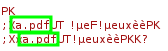

# Machine


# Enumeration

We can enumerate open ports of the system with nmap.


Looking at the results, we have just 2 ports open:
- SSH on port 22
- HTTP server on port 80

So we know we are dealing with a web application.

Scan version of open protocols with Nmap:


Results:


We have confirmed that it is a Linux server using the Apache web server.

# Web Application


This is what the webpage looks like.

Discovering directories with ZAP:


We have a zip file upload directory and a shop page.

Upload page:


Shop page:


## LFI

Testing LFI.


It seems vulnerable. We'll come back to this later

## File Upload

The website only allows PDF files which are zipped to upload.


So let's test to upload and capture the request with BurpSuite.


Then send to the repeater tab. Also forward the request and look at the result at the web page.


PDF File is being uploaded into directory named with hash of the file, and they have the PDF extension. So we have to find a way to RCE via uploading insecure files. The first idea is to get rid of the .pdf extension.



Let's change the extension with Burp to .php.


Response:


We can't pass the firewall.

Let's try something else.


Copy PHP reverse shell and edit our IP and listening port.


Let's zip PHP reverse shell file.


And rename .zip to .pdf.


And zip again with .pdf.


Upload reverse shell.

## RCE

It's time to use LFI. This phar is a PHP wrapper. Let's send our payload to run our PHP reverse shell.


Don't forget to listen :)


Finally, we have our shell.

## Privesc

As usual:

```bash
python3 -c 'import pty;pty.spawn("/bin/bash")'
stty raw -echo; fg
TERM=xterm
```
Let's see what sudo tells us:


We can do sudo stock without a password.


Ohh.. Always think twice.


Good news, we have permission to read.


Let's grep the password.


There you are.


But the program doesn't give much.

So let's dive deeper and do some reverse engineering.


Use strace to see what the program is doing


*No such file or directory*

It happens when the program tries to include a library but couldn't. So we can add our payload to execute with the program and we can get root.


Using msfvenom to create our payload.


Start a web server to upload the payload file.


Also download in .config directory.

Now listen and execute the program with sudo.


We are root!


And here is the flag!!
